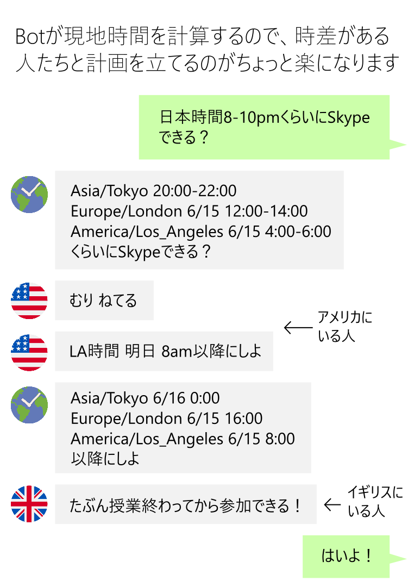

# TimezoneConverter

A Line bot that converts time in one time zone to that of other time zones.

It enables group members from different time zones to arrange their schedules quickly.

## Add TimezoneConverter to your friends

Scan the QR code below:

or jump to the following link:

https://line.me/R/ti/p/%40ggb8791o

## License

This bot uses [Moment.js](https://momentjs.com/) to convert and format time, and [Chrono](https://github.com/wanasit/chrono) to extract time data from messages.

Both are licensed under the [MIT License](https://opensource.org/licenses/mit-license.php).